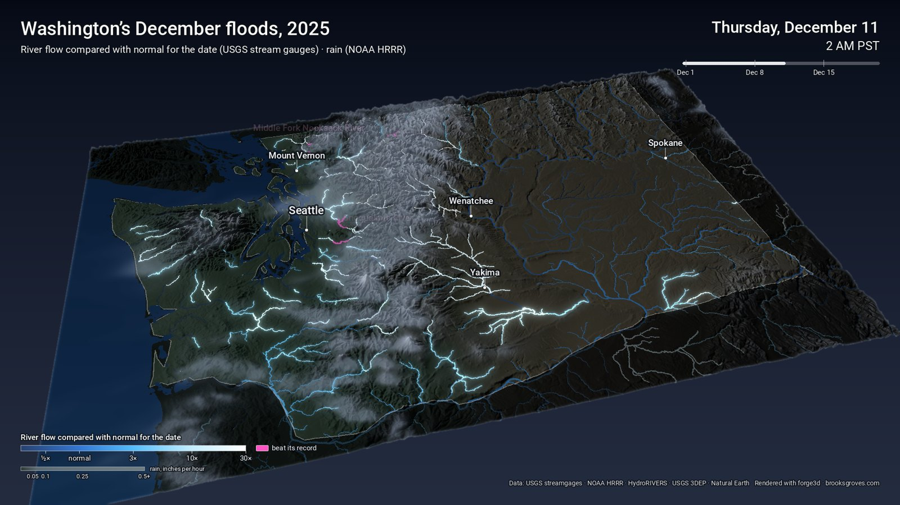

# Washington's December floods, 2025



This animates the rain and the rivers across Washington from December 1 to 20, 2025, hour by hour, over 3D terrain, rendered with [forge3d](https://github.com/milos-agathon/forge3d). In that window a strong atmospheric river stalled over the state on December 8–11, a second storm followed on December 15–18, and by the USGS's count ten rivers set all-time record crests. The film marks the ones its own gauge data confirms: four rivers labelled in pink (the Snoqualmie, Middle Fork Nooksack, Cedar and Ruby Creek), from nine gauges with 20+ years of record that passed their peak. Some of the USGS's ten, like the Skagit at Mount Vernon, don't pass this project's record test; the [write-up](https://brooksgroves.com/blog/wa-floods-post.html) explains why.

On screen:

- **Rain** is the hourly precipitation from NOAA's HRRR model, a blue-grey veil sweeping in off the Pacific.
- **Rivers** are every river draining 150+ km² (HydroRIVERS), wider as they grow. Each is coloured by how its USGS gauge's flow compares with the usual flow for that date:
  - dim blue below normal and bright blue at normal;
  - cyan, then white, at 3×, 10× and 30× normal;
  - **hot pink** once the gauge passes its own record peak.

  Each river reach takes the reading of the first gauge downstream of it. Flooding rivers swell wider and glow.
- **Labels** name each river that beat its record, at the hour it happened. In the final hold they show the peak flow and the year of the old record.

## Run it

```powershell
pixi install
pixi run stills            # downloads the data the first time, then three finished frames to check the look
pixi run render            # 16:9 -> out\wa_floods_2025.mp4  (about 40 s)
pixi run render-square     # 1:1  -> out\wa_floods_2025_1x1.mp4
pixi run render-portrait   # 4:5  -> out\wa_floods_2025_4x5.mp4
```

**Downloads.** The first run downloads everything into `data\`. Later runs reuse it.

- **Terrain and outline** are copied from `..\wa-heat-dome\data`.
- **Rain:** 480 hourly HRRR files from NOAA's open-data bucket on AWS. Only the rain field is downloaded (about 1 MB an hour), 8 at a time.
- **Gauges:** USGS Water Services, no key needed. This covers 15-minute flow for every gauge in the box, plus each gauge's daily-median flow and its annual peaks. Responses are cached in `data\cache\usgs\`.
- **Rivers:** HydroRIVERS North America, a 66 MB zip, downloaded once.

## Render options

| Option | Default | What it does |
|---|---|---|
| `--frames-per-hour` | 2 | 2 frames an hour at 24 fps = 12 hours a second, about 40 s |
| `--hold` | 4 | seconds to hold on the last hour, with the record crests listed |
| `--format` | 16x9 | 16x9, 1x1 or 4x5 |
| `--stills 200,250,end` | off | just these hours from the start (and/or the final frame), finished |
| `--lite` | off | lighter shadows and antialiasing |

To re-finish frames without re-rendering the 3D, run `pixi run finish` (parallel; `--workers N`).

## Caveats

- **"Normal" is the USGS daily median** for that calendar day over each gauge's whole record. Early December medians are low on rain-fed rivers, so moderate storms already read several times normal.
- **Flows are hourly averages** of the 15-minute readings, so they run a little below the true instantaneous crest. That makes the record test conservative.
- **Ungauged reaches** take the nearest gauge downstream, so a small tributary shows its main river's story.
- **The USGS legacy Water Services** used here are scheduled to retire in winter 2026–27. After that, the gauge fetch will need porting to the new `api.waterdata.usgs.gov` endpoints.

## The notebook

**[notebooks/floods.ipynb](notebooks/floods.ipynb)** walks through how this is made, using the project's own scripts: the shared Washington canvas, the rain and the gauges that passed their record crests, how rivers and the rain veil are drawn, and three finished frames from the project's own `render.py --stills`. It's saved with its outputs, so it reads on GitHub without running anything.

To run it yourself: `pixi run stills` once first so the data is downloaded. Sections 1–3 need no renderer; section 4 opens the forge3d viewer and writes to `out/notebook/`, leaving the film alone (a GPU, or on Linux Mesa's software Vulkan under `xvfb-run`). It also needs matplotlib and Jupyter, which aren't in this project's pixi environment.

## Data

- **Rain:** NOAA HRRR via the [NOAA Open Data Dissemination program](https://registry.opendata.aws/noaa-hrrr-pds/).
- **River flow, medians and annual peaks:** [USGS Water Services](https://waterservices.usgs.gov/).
- **River network:** [HydroRIVERS v1.0](https://www.hydrosheds.org/products/hydrorivers) (Lehner & Grill 2013).
- **Terrain:** USGS 3DEP.
- **Outline:** Natural Earth.

Fonts: Roboto (Apache 2.0).
